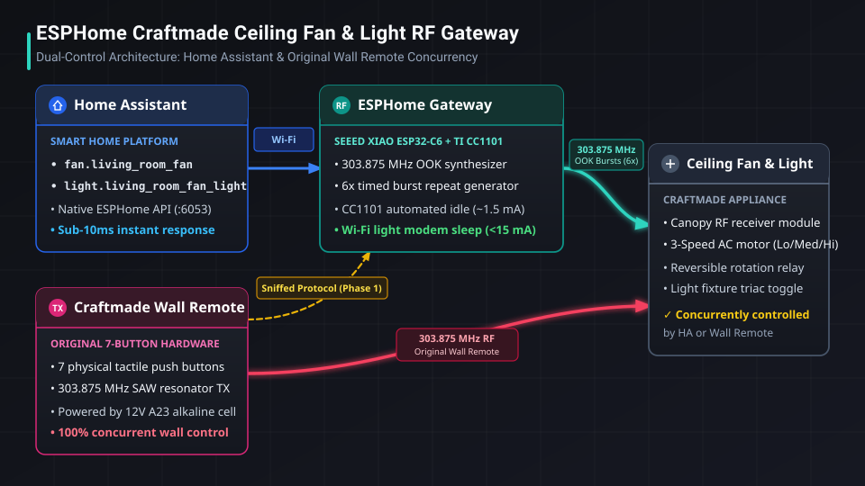
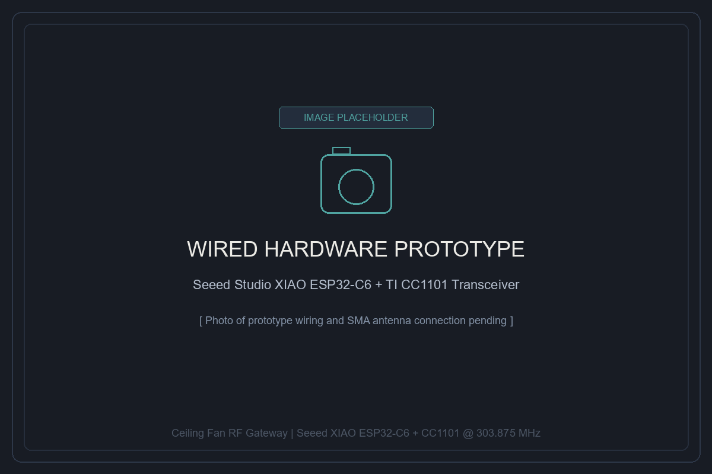
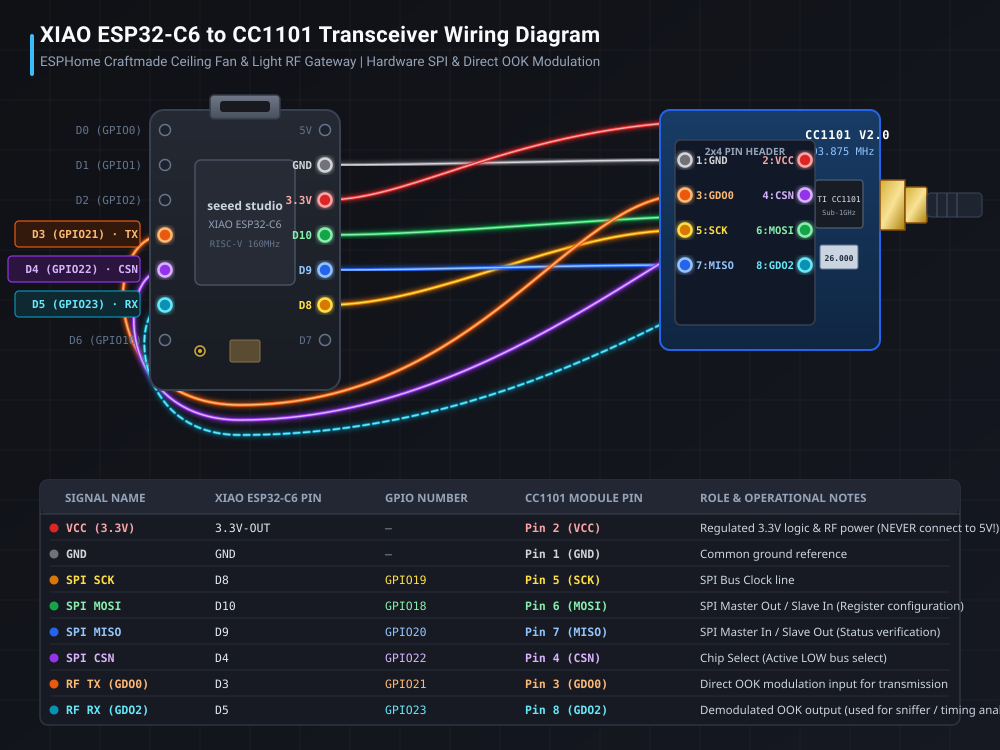
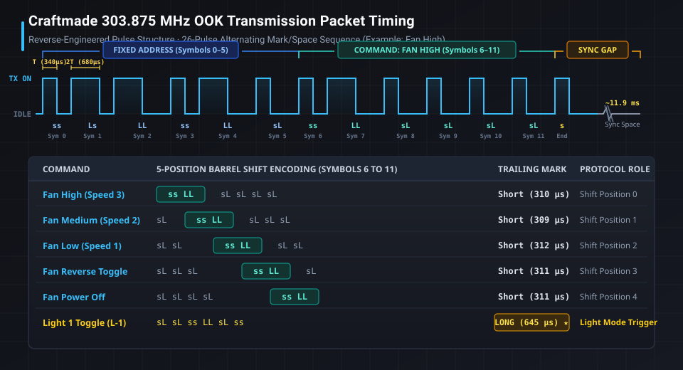

# ESPHome Craftmade Ceiling Fan & Light RF Gateway

[](https://esphome.io/)
[](https://www.seeedstudio.com/Seeed-Studio-XIAO-ESP32C6-p-5884.html)
[](https://www.amazon.com/dp/B0D2TMTV5Z)
[]()
[](LICENSE)

A non-invasive, low-power smart gateway bridging a **303.875 MHz Craftmade ceiling fan and light** into **Home Assistant** using **ESPHome**, a **Seeed Studio XIAO ESP32-C6**, and a **Texas Instruments CC1101** Sub-1 GHz transceiver.

The original physical wall remote continues to operate normally with zero modifications or rewiring, while Home Assistant gains full, native two-way wireless control over fan speeds, direction, and lighting.

---

## Architecture Overview



---

## Photos & Prototypes

| Original Wall Remote | CC1101 Transceiver Module |
| :---: | :---: |
|  |  |
| *Craftmade 7-button wall controller (Model 12V)* | *TI CC1101 with SMA Antenna port* |

| Prototype Wiring Setup | 3D Printed Enclosure |
| :---: | :---: |
|  |  |
| *Soldered breadboard / jumper prototype* | *Custom compact wall/shelf housing* |

---

## Key Highlights

* **Concurrent Dual Control:** The original Craftmade wall remote and Home Assistant control the fan simultaneously without interference or desynchronization.
* **Non-Invasive Installation:** No line voltage rewiring or ladder climbing required. The gateway transmits RF commands directly to the existing receiver in the fan canopy.
* **Low-Power Standby:**
  * **Wi-Fi 802.11 DTIM Modem Sleep (`power_save_mode: LIGHT`):** Gateway idle draw drops from ~90 mA to **<15 mA** while waking in under **10 ms** when Home Assistant commands arrive.
  * **Automated Radio Standby:** CC1101 transitions to `set_idle` on boot and immediately after packet transmission, reducing radio draw to **~1.5 mA**.
  * **Sniffer Deactivation:** Continuous interrupt sniffer is disabled in production to eliminate unnecessary ISR CPU load.
* **Reverse-Engineered Timings:** Mean pulse intervals computed over high-sample-rate continuous sniffer captures, achieving 100% transmission reliability with 6x repeat bursts.
* **Native Home Assistant Entities:** Exposes standard `fan` (with 3-speed step mapping), binary `light`, and discrete action `button` entities.

---

## Hardware Bill of Materials

| Component | Description | Reference Link |
| :--- | :--- | :--- |
| **Microcontroller** | Seeed Studio XIAO ESP32-C6 (RISC-V 160MHz, Wi-Fi 6, BLE 5, USB-C) | [Seeed Studio](https://www.seeedstudio.com/Seeed-Studio-XIAO-ESP32C6-p-5884.html) |
| **RF Transceiver** | TI CC1101 Sub-1 GHz Wireless Transceiver Module with SMA Antenna | [Amazon](https://www.amazon.com/dp/B0D2TMTV5Z) |
| **Antenna** | 315/433 MHz SMA rubber ducky antenna (included with module) | Included |
| **Power Supply** | Standard 5V USB-C power adapter | Standard |
| **Enclosure** | Custom 3D-printed compact housing | *Pending* |

---

## Hardware & Wiring

The Texas Instruments CC1101 communicates with the ESP32-C6 via hardware SPI. In addition, **GDO0** is connected to a dedicated output pin for direct 100% duty-cycle OOK modulation, and **GDO2** is wired for RF sniffing and timing analysis.



### Pinout Mapping Table

> [!CAUTION]
> The CC1101 operates strictly on **3.3V logic and power**. Connect VCC to the **3.3V-OUT** pin of the XIAO ESP32-C6, **NEVER** to 5V / VBUS.

| Signal | XIAO Silk Pin | ESP32-C6 GPIO | CC1101 Pin | Wire Color (Diagram) | Description |
| :--- | :--- | :--- | :--- | :--- | :--- |
| **VCC** | `3.3V-OUT` | — | **Pin 2** (`VCC`) | 🔴 Red | 3.3V Regulated Power |
| **GND** | `GND` | — | **Pin 1** (`GND`) | ⚫ Gray/Black | Common Ground |
| **SPI SCK** | `D8` | `GPIO19` | **Pin 5** (`SCK`) | 🟡 Amber | SPI Bus Clock |
| **SPI MOSI** | `D10` | `GPIO18` | **Pin 6** (`MOSI`) | 🟢 Green | SPI Master Out |
| **SPI MISO** | `D9` | `GPIO20` | **Pin 7** (`MISO`) | 🔵 Blue | SPI Master In |
| **SPI CSN** | `D4` | `GPIO22` | **Pin 4** (`CSN`) | 🟣 Purple | SPI Chip Select (Active LOW) |
| **RF TX (GDO0)** | `D3` | `GPIO21` | **Pin 3** (`GDO0`) | 🟠 Orange | Direct Carrier Modulation Output |
| **RF RX (GDO2)** | `D5` | `GPIO23` | **Pin 8** (`GDO2`) | 🔵 Cyan (Dashed) | Demodulated OOK Receiver (Sniffer) |

---

## RF Protocol Analysis

Reverse engineering was conducted by capturing continuous raw dumps using `remote_receiver` on the CC1101 GDO2 pin:



* **Base Time Unit ($T$):** $\approx 330\text{–}350\,\mu\text{s}$ (short pulse $s$)
* **Long Time Unit ($2T$):** $\approx 650\text{–}710\,\mu\text{s}$ (long pulse $L$)
* **Frame Length:** 12 symbols (24 mark/space pulses) + 1 trailing mark + 1 sync space gap ($\approx 11.9\,\text{ms}$) = **26 pulses**.
* **Fixed Address:** `ss Ls LL ss LL sL` (constant across all buttons).
* **Speed Commands:** Exact 5-position barrel shift of `ss LL`:
  * **High:** `ss LL sL sL sL sL`
  * **Medium:** `sL ss LL sL sL sL`
  * **Low:** `sL sL ss LL sL sL`
  * **Reverse:** `sL sL sL ss LL sL`
  * **Off:** `sL sL sL sL ss LL`
* **Light Command:** Terminated with a **long mark** ($L \approx 645\,\mu\text{s}$) on the 25th pulse instead of a short mark ($s \approx 310\,\mu\text{s}$).

For full timing tables and mathematical frame analysis, see [docs/rf-protocol-analysis.md](docs/rf-protocol-analysis.md).

---

## Home Assistant Entities

Once added to Home Assistant via the native ESPHome integration, the gateway automatically generates:

| Entity ID | Domain | Function |
| :--- | :--- | :--- |
| `fan.living_room_ceiling_fan` | `fan` | 3-speed fan template (33% Low, 67% Med, 100% High, Off) |
| `light.living_room_fan_light` | `light` | Binary light toggle output |
| `button.living_room_fan_light_1_toggle` | `button` | Discrete Light 1 RF Toggle |
| `button.living_room_fan_speed_low` | `button` | Discrete Fan Speed 1 (Low) |
| `button.living_room_fan_speed_medium` | `button` | Discrete Fan Speed 2 (Medium) |
| `button.living_room_fan_speed_high` | `button` | Discrete Fan Speed 3 (High) |
| `button.living_room_fan_reverse` | `button` | Discrete Fan Reverse trigger |
| `button.living_room_fan_power_off` | `button` | Discrete Fan Power Off trigger |

---

## Software & Tools

The [`tools/`](tools/) folder contains the Python scripts used during reverse engineering:

* **`continuous_sniffer.py`**: Connects to the ESPHome Native API via `aioesphomeapi` and logs raw pulse bursts with microsecond timestamps.
* **`analyze_signals.py`**: Parses logged bursts, clusters packet lengths, and computes arithmetic mean timings for production YAML scripts.
* **`decode_bits.py`**: Converts microsecond timing arrays into symbolic bit patterns (`s` vs `L`) and extracts address/command structure.

---

## Installation & Deployment

1. **Prerequisites:**
   * ESPHome 2026.8.1 or newer.
   * Home Assistant with ESPHome integration.
2. **Secrets Configuration:**
   Copy `esphome/secrets.yaml.example` to `esphome/secrets.yaml` and configure your Wi-Fi credentials:
   ```bash
   cp esphome/secrets.yaml.example esphome/secrets.yaml
   ```
3. **Flashing Firmware:**
   Compile and flash the configuration via ESPHome CLI or dashboard:
   ```bash
   esphome run esphome/ceiling-fan-rf.yaml
   ```
4. **Home Assistant Discovery:**
   The device will be discovered automatically on your local network. Assign it to your desired Area (e.g., `Living Room`).

---

## License

This project is licensed under the [MIT License](LICENSE).
